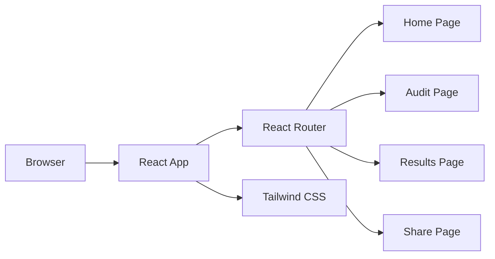

# Architecture

## Overview

BurnRate AI is a front-end MVP built as a single-page application with React and Vite. The goal for Day 1 is to establish a credible product shell, routing structure, and styling foundation.

## Data flow

1. The browser loads the Vite-built bundle.
2. `src/main.tsx` mounts the React app and initializes routing.
3. `src/App.tsx` provides the app frame and navigation.
4. Pages render content and will eventually connect to audit logic.

## Why React + Vite

- React is a dependable choice for interactive SaaS user interfaces.
- Vite gives fast local refresh, small build times, and easy TypeScript support.
- This combination is common for internship-level front-end products.

## Scaling later

- Add a real audit engine in `src/services/` and connect it to a backend or local computation layer.
- Introduce feature modules for stack entry, spend simulation, and report export.
- Keep routing and layout stable while expanding individual page logic.
